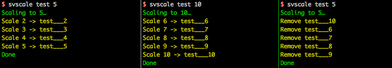

# `svscale`, the tool to scale your runit services

## Install

Download the last `svscale.phar` available in [releases](https://github.com/monsieurbiz/svscale/releases).

Then rename it if you want to `svscale`. Put it in your `~/bin/` directory or somewhere else in your `$PATH`.

And finally turn on the execution flag (`chmod +x svscale`).

## How to use it

Get the help by running `svscale`, `svscale -h` or `svscale --help`.

## License

Please see the `LICENSE` file attached with this source code.

## Maintainer

This project is maintained by [Monsieur Biz](https://github.com/monsieurbiz).